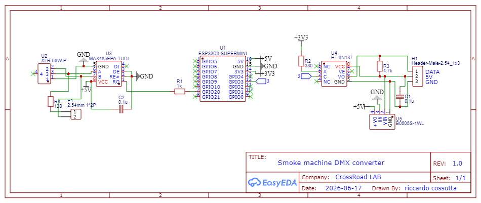
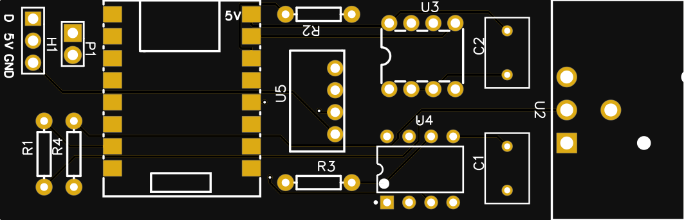
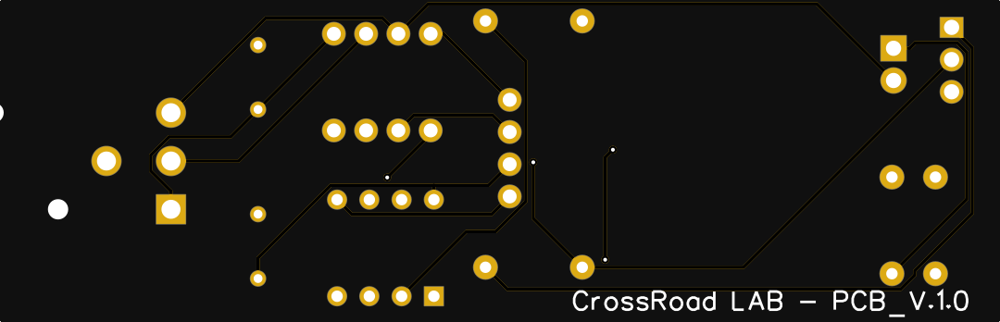
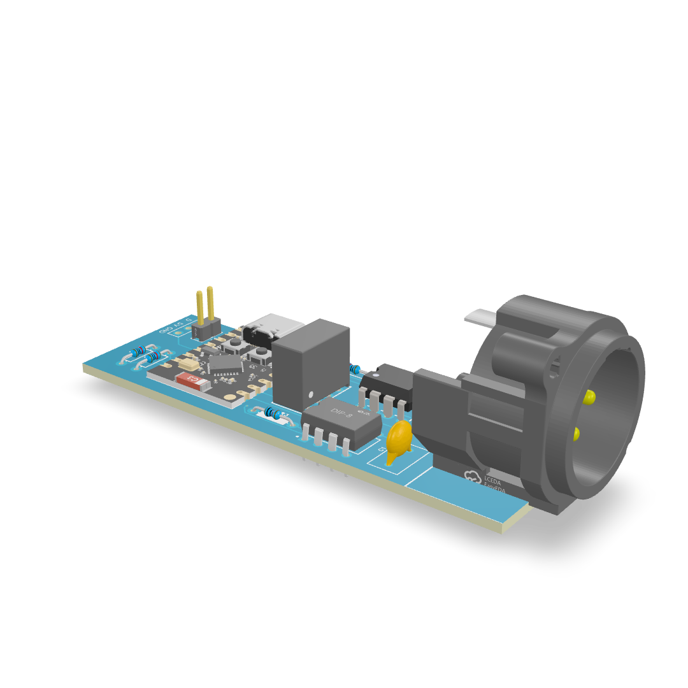

# DMX Smoke Machine Converter/Controller 🌫️
  

Un modulo hardware/software progettato per trasformare una comune macchina del fumo RF (Radio Frequenza) economica in un affidabile nodo DMX professionale, pronto per il palco. 

Nato per sopravvivere ai ground loop, agli sbalzi di tensione e alle vibrazioni estreme tipiche dei set live, questo controller isola galvanicamente la logica di controllo dal circuito di potenza della macchina, garantendo zero interferenze sulla catena luci. Include un'interfaccia web ad alto contrasto (stile raw/monospace) accessibile tramite Captive Portal per il setup istantaneo durante i cambi palco.

---

## 🎛️ Feature Principali
* **Isolamento Galvanico Totale:** Grazie al convertitore DC-DC isolato B0505S-1W e all'optoisolatore ad alta velocità 6N137, le masse della macchina del fumo e del bus DMX non si toccano mai. Addio rumori di linea.
* **Ricezione DMX Hardware:** Sfrutta gli interrupt nativi dell'ESP32 e la libreria `esp_dmx` per una ricezione del segnale granitica e non-bloccante.
* **Terminatore DMX Escludibile:** Jumper integrato sul PCB per attivare la resistenza di terminazione da 120Ω se la macchina è l'ultimo anello della catena.
* **Captive Portal UI:** Nessun IP da ricordare. Collegati al Wi-Fi del modulo con lo smartphone e l'interfaccia di setup si aprirà automaticamente (stile login degli hotel).
* **Configurazione Persistente:** Il canale DMX, il nome del Wi-Fi, la password e la lingua (IT/EN) vengono salvati nella memoria Flash permanente (NVS).

---

## 🔌 Bill of Materials (BOM)

| Componente | Quantità | Descrizione / Ruolo |
| :--- | :--- | :--- |
| **ESP32-C3 Super Mini** | 1 | Microcontrollore RISC-V con Wi-Fi (Logica principale) |
| **MAX485 (Modulo TTL)** | 1 | Transceiver RS-485 per la lettura del bus DMX |
| **6N137** | 1 | Optoisolatore High-Speed per il segnale DATA (Active-LOW) |
| **B0505S-1W** | 1 | Convertitore DC-DC isolato (ingresso 5V sporchi / uscita 5V puliti) |
| **Connettore XLR 3-Pin** | 1 | Maschio, da pannello (Ingresso DMX) |
| **Resistenze** | 4 | 330Ω, 1kΩ, 4.7kΩ (Pull-up), 120Ω (Terminatore) |
| **Condensatori Ceramici**| 2 | 100nF (0.1µF) per il disaccoppiamento di MAX485 e 6N137 |
| **Header 2-Pin** | 1 | Per includere o escludere la resistenza da 120Ω (Terminatore) |
| **Header 3-Pin** | 1 | Per l'interfaccia alla PCB della macchina del fumo (5V, DATA, GND) |

---

## 🛠️ Schema Elettrico e Design PCB

Il circuito prevede due domini di massa rigorosamente separati: la linea pulita (ESP32/MAX485) e la linea sporca (Macchina del fumo).

Assicurarsi di includere le immagini esportate dal CAD nella cartella del progetto (es. `docs/`):
* Schema elettrico: `
* Layout/Render PCB: 

* Modello 3D: 
---

## 🖥️ Requisiti Software e Librerie

⚠️ **ATTENZIONE FONDAMENTALE:** A causa delle modifiche recenti nell'ESP-IDF di Espressif, per compilare con successo la libreria DMX è necessario effettuare un downgrade del core ESP32 nel Gestore Schede dell'IDE di Arduino.

1. Apri il Gestore Schede dell'IDE di Arduino.
2. Cerca `esp32` by Espressif Systems.
3. Seleziona e installa la versione **`2.0.17`**.

**Librerie Esterne Richieste (installabili dal Library Manager):**
* `esp_dmx` (v4.1) by Mitch Weisbrod (someweisguy)
* `ESPAsyncWebServer` by me-no-dev
* `rc-switch` by sui77
* `Preferences` (inclusa nel core ESP32)
* `DNSServer` (inclusa nel core ESP32)

---

## 💻 Il Firmware

Carica lo sketch contenuto nel file `.ino` selezionando la scheda **ESP32C3 Dev Module** con le seguenti opzioni attive nel menù Strumenti:
* *USB CDC On Boot:* **Enabled**
* *Flash Size:* **4MB**
* *Partition Scheme:* **Default 4MB with spiffs**
