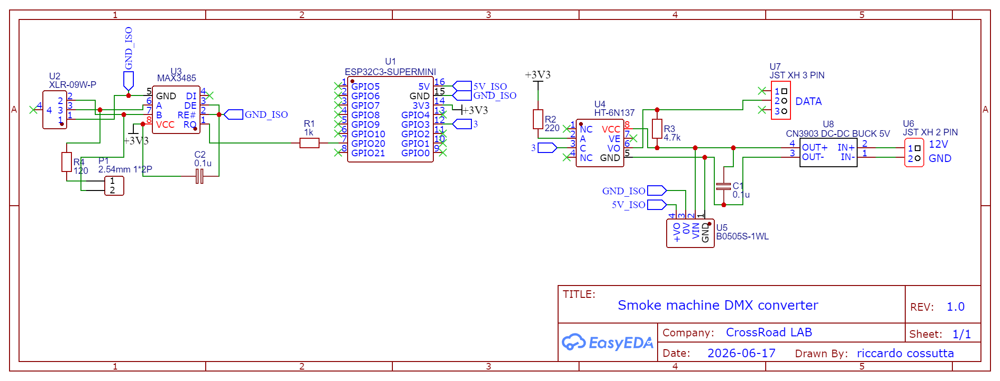
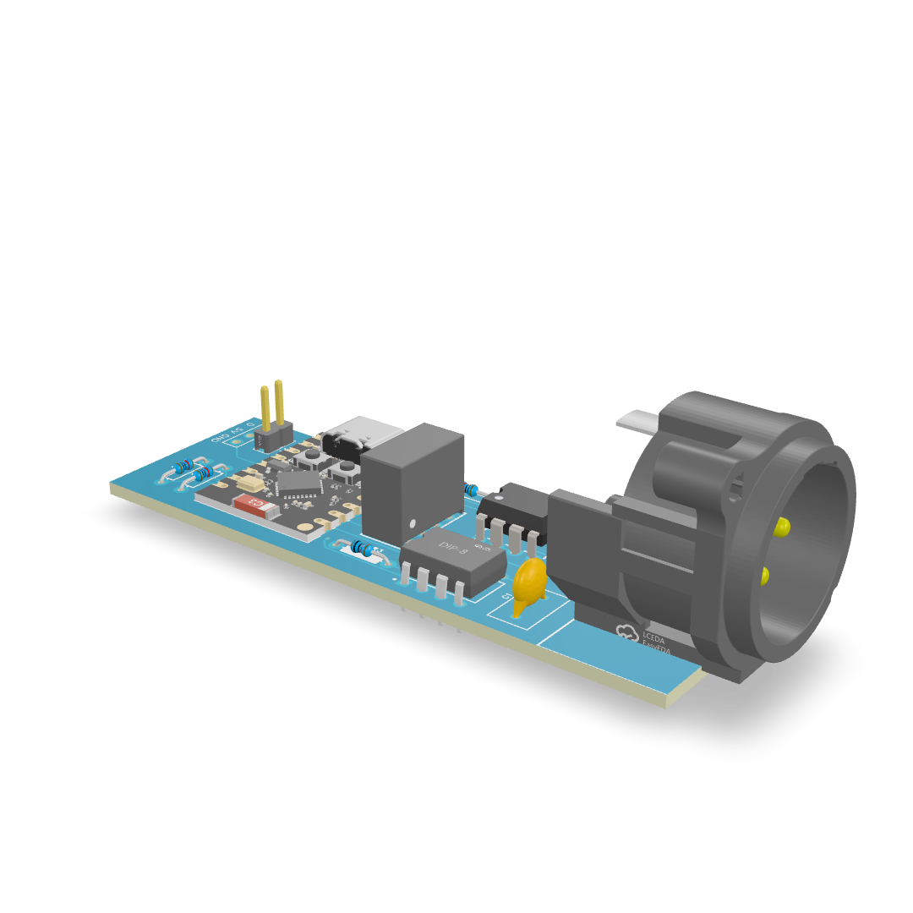
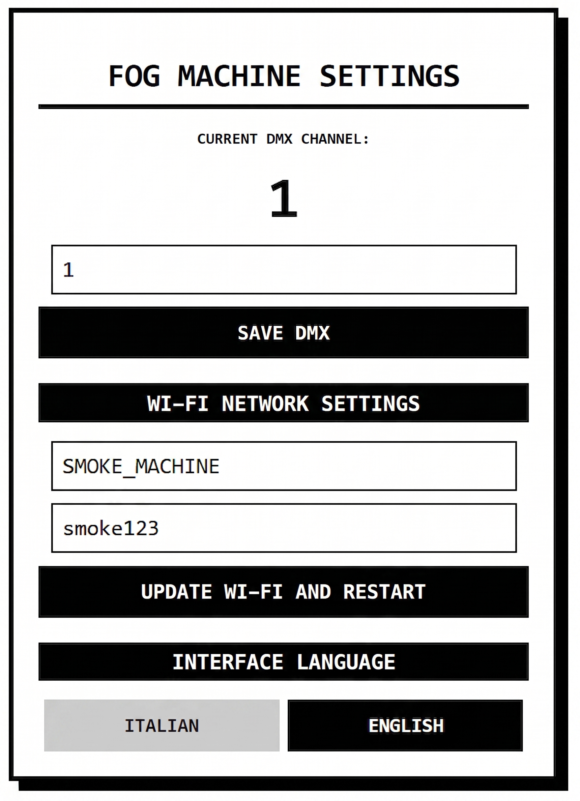

# DMX Smoke Machine Converter/Controller
  

A hardware/software module designed to transform a standard, cheap RF (Radio Frequency) smoke machine into a reliable, stage-ready professional DMX node. 

Built to survive ground loops, voltage spikes, and extreme vibrations typical of live sets, this controller galvanically isolates the control logic from the machine's power circuit, ensuring zero interference on the lighting chain. It includes a high-contrast web interface (raw/monospace style) accessible via Captive Portal for instant setup during stage changeovers.

---

## 🎛️ Main Features
* **Total Galvanic Isolation:** Thanks to the B0505S-1W isolated DC-DC converter and the 6N137 high-speed optoisolator, the grounds of the smoke machine and the DMX bus never touch. Say goodbye to line noise.
* **Hardware DMX Reception:** Leverages the ESP32's native interrupts and the `esp_dmx` library for rock-solid, non-blocking signal reception.
* **Switchable DMX Terminator:** Onboard PCB jumper to activate the 120Ω termination resistor if the machine is the last link in the chain.
* **Captive Portal UI:** No IP addresses to remember. Connect to the module's Wi-Fi with your smartphone, and the setup interface will pop up automatically (like a hotel login).
* **Persistent Configuration:** The DMX channel, Wi-Fi SSID, password, and language (IT/EN) are saved in the permanent Flash memory (NVS).

---

## 🔌 Bill of Materials (BOM)

| Component | Quantity | Designator | Description / Role |
| :--- | :---: | :---: | :--- |
| **ESP32-C3 SuperMini** | 1 | U1 | RISC-V Microcontroller with Wi-Fi (Main logic and Web Server) |
| **MAX3485** | 1 | U3 | Native 3.3V RS-485 Transceiver (DMX bus reading) |
| **HT-6N137** | 1 | U4 | High-Speed Optoisolator (Optical separation of the DATA signal) |
| **B0505S-1WL** | 1 | U5 | Isolated DC-DC Converter ("Dirty" 5V Input / Isolated "clean" 5V Output) |
| **CN3903 DC-DC Buck 5V** | 1 | U8 | Step-Down Converter Module (Steps down the 12V from the machine to 5V) |
| **XLR-09W-P 3-Pin Connector** | 1 | U2 | PCB Mount Male (DMX signal input) |
| **JST XH 2-Pin (2.54mm pitch)** | 1 | U6 | Power input (12V and GND from the machine's motherboard) |
| **JST XH 3-Pin (2.54mm pitch)** | 1 | U7 | Command output to the smoke machine (5V, DATA, GND) |
| **220Ω Resistor** | 1 | R2 | Current limiting resistor for the optoisolator LED |
| **1kΩ Resistor** | 1 | R1 | Protection for the ESP32 RX line |
| **4.7kΩ Resistor** | 1 | R3 | Pull-up for the DATA line (Machine side) |
| **120Ω Resistor** | 1 | R4 | DMX bus termination |
| **100nF (0.1µF) Capacitor** | 2 | C1, C2 | Decoupling capacitors (on MAX3485 and Buck output) |
| **1x2 Pin Header (2.54mm pitch)** | 1 | P1 | Male header for DMX termination block |
| **Jumper Cap (2.54mm pitch)** | 1 | - | Cap to close the jumper on P1 (Activates the 120Ω resistor) |

---

## 🛠️ Schematic and PCB Design

The circuit features two strictly separated ground domains: the clean line (ESP32/MAX485) and the dirty line (Smoke machine).
*P.S. The GND, DATA, and 5V pins must be connected in place of the smoke machine's RF receiver.*
* Schematic: 
* PCB Specification: 
* 3D Model (click the image to view the model): 

---

## 🖥️ Software Requirements and Libraries

⚠️ **CRITICAL WARNING:** Due to recent changes in Espressif's ESP-IDF, to successfully compile the DMX library, you must downgrade the ESP32 core in the Arduino IDE Boards Manager.

1. Open the Arduino IDE Boards Manager.
2. Search for `esp32` by Espressif Systems.
3. Select and install version **`2.0.17`**.

**Required External Libraries (installable via Library Manager):**
* `esp_dmx` (v4.1) by Mitch Weisbrod (someweisguy)
* `ESPAsyncWebServer` by me-no-dev
* `rc-switch` by sui77
* `Preferences` (included in the ESP32 core)
* `DNSServer` (included in the ESP32 core)

---

## 💻 The Firmware

Upload the sketch contained in the `.ino` file by selecting the **ESP32C3 Dev Module** board with the following options enabled in the Tools menu:
* *USB CDC On Boot:* **Enabled**
* *Flash Size:* **4MB**
* *Partition Scheme:* **Default 4MB with spiffs**

Default WIFI Settings:
* **SSID**: SMOKE_MACHINE
* **PSWD**: smoke123

---

## 📡 Sniffing the remote control codes

To sniff the RF remote control codes, I recommend following this project: [Luca Bocaletto's Project Link](https://github.com/bocaletto-luca/RF-Sniffer-Replayer)
#Sniffed Codes: 
* Smoke on: 1469186558
* Smoke off: 1469187068 
* R: 1469187323
* G: 1469187578
* B: 1469187833
* Light off: 1469195483
* Strobo: 1469190383
  
---

## 🛠️ How to mount on smoke machine

