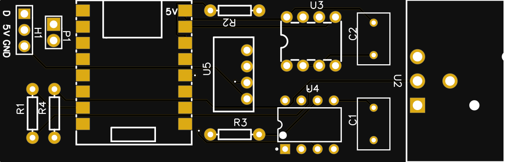
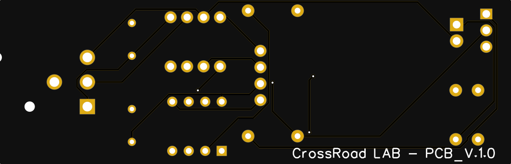

# DMX Smoke Machine Converter/Controller
  

Un modulo hardware/software progettato per trasformare una comune macchina del fumo RF (Radio Frequenza) economica in un affidabile nodo DMX professionale, pronto per il palco. 

Nato per sopravvivere ai ground loop, agli sbalzi di tensione e alle vibrazioni estreme tipiche dei set live, questo controller isola galvanicamente la logica di controllo dal circuito di potenza della macchina, garantendo zero interferenze sulla catena luci. Include un'interfaccia web ad alto contrasto (stile raw/monospace) accessibile tramite Captive Portal per il setup istantaneo durante i cambi palco.

---

## 🎛️ Feature Principali
* **Isolamento Galvanico Totale:** Grazie al convertitore DC-DC isolato B0505S-1W e all'optoisolatore ad alta velocità 6N137, le masse della macchina del fumo e del bus DMX non si toccano mai. Addio rumori di linea.
* **Ricezione DMX Hardware:** Sfrutta gli interrupt nativi dell'ESP32 e la libreria `esp_dmx` per una ricezione del segnale granitica e non-bloccante.
* **Terminatore DMX Escludibile:** Jumper integrato sul PCB per attivare la resistenza di terminazione da 120Ω se la macchina è l'ultimo anello della catena.
* **Captive Portal UI:** Nessun IP da ricordare. Collegati al Wi-Fi del modulo con lo smartphone e l'interfaccia di setup si aprirà automaticamente (stile login degli hotel).
* **Configurazione Persistente:** Il canale DMX, il nome del Wi-Fi, la password e la lingua (IT/EN) vengono salvati nella memoria Flash permanente (NVS).

---

## 🔌 Bill of Materials (BOM)

| Componente | Quantità | Designator | Descrizione / Ruolo |
| :--- | :---: | :---: | :--- |
| **ESP32-C3 SuperMini** | 1 | U1 | Microcontrollore RISC-V con Wi-Fi (Logica principale e Web Server) |
| **MAX3485** | 1 | U3 | Transceiver RS-485 nativo a 3.3V (Lettura bus DMX) |
| **HT-6N137** | 1 | U4 | Optoisolatore High-Speed (Separazione ottica segnale DATA) |
| **B0505S-1WL** | 1 | U5 | Convertitore DC-DC isolato (Ingresso 5V sporchi / Uscita 5V puliti isolati) |
| **CN3903 DC-DC Buck 5V** | 1 | U8 | Modulo convertitore Step-Down (Abbassa i 12V della macchina a 5V) |
| **Connettore XLR-09W-P 3-Pin** | 1 | U2 | Maschio da PCB (Ingresso segnale DMX) |
| **JST XH 2-Pin (Passo 2.54mm)** | 1 | U6 | Ingresso alimentazione (12V e GND dalla scheda madre della macchina) |
| **JST XH 3-Pin (Passo 2.54mm)** | 1 | U7 | Uscita comando verso la macchina del fumo (5V, DATA, GND) |
| **Resistenza 220Ω** | 1 | R2 | Limitatore di corrente per il LED dell'optoisolatore |
| **Resistenza 1kΩ** | 1 | R1 | Protezione linea RX dell'ESP32 |
| **Resistenza 4.7kΩ** | 1 | R3 | Pull-up per la linea DATA (Lato macchina) |
| **Resistenza 120Ω** | 1 | R4 | Terminazione bus DMX |
| **Condensatore 100nF (0.1µF)** | 2 | C1, C2 | Condensatori di disaccoppiamento (su MAX3485 e uscita Buck) |
| **Pin Header 1x2 (Passo 2.54mm)** | 1 | P1 | Header maschio per blocco terminazione DMX |
| **Jumper Cap (Passo 2.54mm)** | 1 | - | Cappuccio per chiudere il ponticello su P1 (Attiva resistenza 120Ω) |

---

## 🛠️ Schema Elettrico e Design PCB

Il circuito prevede due domini di massa rigorosamente separati: la linea pulita (ESP32/MAX485) e la linea sporca (Macchina del fumo).
PS. I pin GND, DATA e 5V devono essere collegati al posto del ricevitore RF della macchina del fumo.
* Schema elettrico: `
* Layout/Render PCB: 

* Modello 3D (clicca l'immagine per visualizzare il modello): 
---

## 🖥️ Requisiti Software e Librerie

⚠️ **ATTENZIONE FONDAMENTALE:** A causa delle modifiche recenti nell'ESP-IDF di Espressif, per compilare con successo la libreria DMX è necessario effettuare un downgrade del core ESP32 nel Gestore Schede dell'IDE di Arduino.

1. Apri il Gestore Schede dell'IDE di Arduino.
2. Cerca `esp32` by Espressif Systems.
3. Seleziona e installa la versione **`2.0.17`**.

**Librerie Esterne Richieste (installabili dal Library Manager):**
* `esp_dmx` (v4.1) by Mitch Weisbrod (someweisguy)
* `ESPAsyncWebServer` by me-no-dev
* `rc-switch` by sui77
* `Preferences` (inclusa nel core ESP32)
* `DNSServer` (inclusa nel core ESP32)

---

## 💻 Il Firmware

Carica lo sketch contenuto nel file `.ino` selezionando la scheda **ESP32C3 Dev Module** con le seguenti opzioni attive nel menù Strumenti:
* *USB CDC On Boot:* **Enabled**
* *Flash Size:* **4MB**
* *Partition Scheme:* **Default 4MB with spiffs**

Impostazioni di default del WIFI:
* **SSID**: SMOKE_MACHINE
* **PSWD**: smoke123

---

## 📡 Sniffare i codici del telecomado

Per fare lo sniffing dei codici del telecomando consiglio di seguire questo progetto: [Link del progetto di Bocaletto Luca](https://github.com/bocaletto-luca/RF-Sniffer-Replayer)
